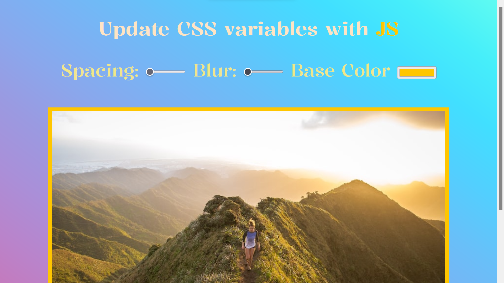

# CSS variables and JS

This is a solution to the [CSS variables and JS]() This is challenge from WesBos to train beginners Vanilla JS. This is Day3 Project.  

## Table of contents

- [Overview](#overview)
  - [The challenge](#the-challenge)
  - [Screenshot](#screenshot)
  - [Links](#links)
- [My process](#my-process)
  - [Built with](#built-with)
- [Author](#author)

**Note: Delete this note and update the table of contents based on what sections you keep.**

## Overview

### The challenge

Users should be able to:

- Scroll the progressbar and see changes as bluring,padding, and backgroundColor changed of the image.

### Screenshot

### Links

- Solution URL: [Solution URL here](https://www.github.com/Ashraful-Fuqha/css-variables-js/)
- Live Site URL: [Live site URL here](https://ashraful-fuqha.github.io/css-variables-js/)

## My process

### Built with

- Semantic HTML5 markup
- CSS3
- Flexbox 
- Vanilla JS

## Author

- Website - Definetly
- GitHub - [@MjafarsadiqD](https://github.com/Ashraful-Fuqha)